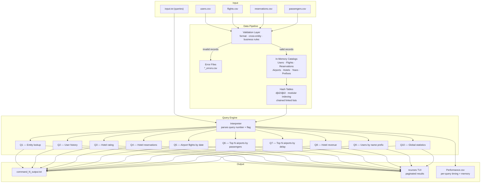
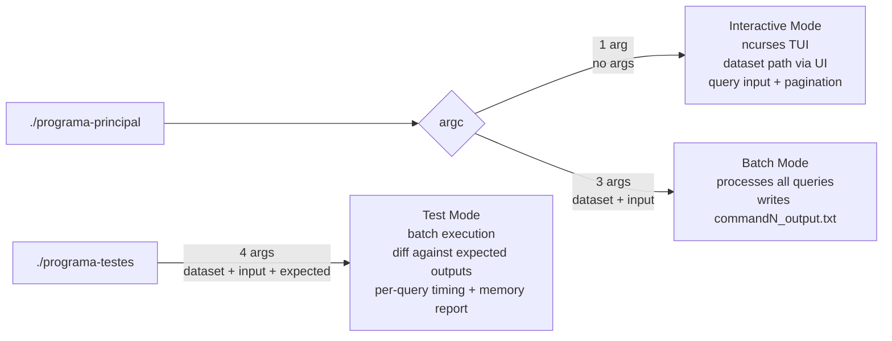

# Aviation Data Management & Query Engine

> A high-performance data processing engine written in C that ingests large CSV datasets from an aviation platform — users, flights, reservations, and passengers — validates every record against strict business rules, indexes them in custom hash tables, and answers 10 analytical queries in both batch and interactive (ncurses TUI) modes, with nanosecond-precision per-query performance profiling.

---

## Overview

This project implements a full data pipeline for an aviation management system. Given four raw CSV files, the engine validates and loads all records into an in-memory catalog built on custom hash tables, then processes a query file or enters an interactive terminal UI where queries can be run and results paginated on screen.

The system is built entirely in C with no external database dependencies — all indexing, lookup, sorting, and aggregation is hand-implemented using POSIX system calls and standard C libraries.

---

## Architecture



---

## Execution Modes

The system compiles into two binaries with three distinct execution modes:



---

## Data Model & Validation

Each CSV file is parsed field-by-field (semicolon-delimited) and every record is validated before being admitted to the catalog. Invalid records are written to a corresponding `*_errors.csv` file.

| Entity | Fields | Key Validation Rules |
|---|---|---|
| **Users** | 12 fields | Email format, valid date of birth, account creation after birth date, valid country code (2 chars), account status (`active`/`inactive`) |
| **Flights** | 13 fields | Valid airport codes (3 uppercase letters), scheduled departure before arrival, real departure before arrival, seats > 0 |
| **Reservations** | 14 fields | Referenced user must exist and be valid, check-in before check-out, hotel stars 1–5, price per night > 0, rating 1–5 |
| **Passengers** | 2 fields | Referenced flight ID and user ID must both exist in the valid catalogs |

---

## Hash Table Design

All entity lookups run in O(1) average time via a custom hash layer:

| Entity | Hash Strategy |
|---|---|
| Users | djb3 (case-insensitive djb2 + XOR) over user ID string |
| Flights | Numeric ID modulo table size |
| Reservations | Numeric suffix of `BookXXXXXXX` modulo table size |
| Hotels | Numeric suffix of hotel ID modulo table size |
| Airports | djb3 over 3-letter airport code |
| Name prefixes (≤4 chars) | Direct ASCII mapping |
| Name prefixes (≥5 chars) | djb3 over first 5 characters |
| Years | Direct offset from base year 2010 |

Collisions are resolved via chained linked lists. Each catalog slot holds a pointer to the head of its chain, and lookups traverse the chain comparing keys with `strcmp` / `strcoll`.

---

## Query Reference

Every query supports an optional `F` suffix (e.g. `1F`, `5F`) that switches the output to a more detailed formatted mode. Results are written to numbered output files in batch mode or displayed with pagination in interactive mode.

| Query | Description | Key Operation |
|---|---|---|
| **Q1** `<id>` | Look up any entity by ID — auto-detects user, flight (`000...`), or reservation (`Book...`) | Hash lookup → format entity fields |
| **Q2** `<user-id> [flights\|reservations]` | List a user's flights and/or reservations sorted by date descending | Hash lookup → `qsort` on index arrays |
| **Q3** `<hotel-id>` | Compute a hotel's average rating across all reservations | Iterate hotel reservation list → running sum |
| **Q4** `<hotel-id>` | List all reservations for a hotel sorted by check-in date descending | Hash lookup → `qsort` on index arrays |
| **Q5** `<airport> <begin> <end>` | List all flights departing from an airport within a date range | Hash lookup → filter by date → `qsort` |
| **Q6** `<year> <N>` | Top N airports by total passengers in a given year (2021–2023) | Sort airport list by yearly passenger count |
| **Q7** `<N>` | Top N airports by median departure delay | Pre-computed per-airport delay sorted list → `qsort` by median |
| **Q8** `<hotel-id> <begin> <end>` | Total revenue for a hotel between two dates | Iterate reservations → compute night overlap → sum price × nights |
| **Q9** `<prefix>` | All active users whose name starts with `prefix`, sorted alphabetically then by ID | Prefix hash lookup → `qsort` with `strcoll` |
| **Q10** `[year [month]]` | Global statistics: new users, flights, passengers, unique passengers, reservations — by year, year+month, or all years from 2010 | Year/month catalog aggregation |

---

## Interactive Mode

When launched without arguments, the program enters a full-screen **ncurses TUI**:

- ASCII art title screen with color pairs
- Arrow-key navigable main menu: **Start**, **Help**, **Credits**, **Leave**
- Dataset path input prompt
- Query input with live result display
- Paginated output for multi-row query results (keyboard-navigable pages)

---

## Performance Profiling

Test mode (`./programa-testes`) instruments every query with `clock_gettime(CLOCK_REALTIME)` and reports individual execution times alongside total application time and peak RSS memory via `getrusage`. Results are written to `Resultados/Performance.csv`.

```
Query 1 time:  0.000312 seconds
Query 2 time:  0.001047 seconds
...
Application time: 1.823401 seconds
Memory usage: 74832 KB
```

The main build uses `-O3` for maximum compiler optimization; a `valgrind` Makefile target is also provided for full memory leak analysis.

---

## Project Structure

```
.
├── src/
│   ├── Main.c                     # Entry point; mode dispatch
│   ├── Parser.c                   # CSV file opening, field-by-field parsing, catalog population
│   ├── Catalogs.c                 # All entity structs, getters/setters, catalog arrays
│   ├── Hash.c                     # Hash functions (djb2/djb3) and index resolution
│   ├── Validation.c               # Per-entity validation logic
│   ├── Aux_validation.c           # Field-level validators (email, date, airport code…)
│   ├── Aux_functions.c            # Sorting comparators, date arithmetic, utility functions
│   ├── Queries.c                  # Implementations of Q1–Q10
│   ├── Interpreter.c              # Query file parser; dispatches to Q1–Q10
│   ├── Output_queries.c           # Result formatting and file/screen output
│   ├── Output_errors.c            # Error record writing
│   ├── Menu.c                     # ncurses main menu
│   ├── Menu_options.c             # Menu action handlers
│   ├── Interactive_mode_screens.c # TUI screens and query interaction
│   ├── Pagination.c               # Paginated result display
│   ├── Performance.c              # Per-query and total timing; memory reporting
│   ├── Free.c                     # Full catalog memory deallocation
│   └── Tests.c                    # Output file diffing for test mode
│
├── include/                       # Header files for all modules
├── dataset/
│   ├── data/                      # Raw CSV input files (with intentional errors)
│   ├── data_clean/                # Clean CSV input files
│   ├── input.txt                  # Sample query file (100 queries)
│   └── outputs/                   # Expected output files for test mode
└── Makefile
```

---

## Building

```bash
make
```

Compiles all sources with `gcc -O3 -Wall -Wextra -pedantic` and produces:
- `programa-principal` — main application
- `programa-testes` — test runner

Clean build artifacts:
```bash
make clean
```

---

## Usage

### Batch mode

```bash
./programa-principal dataset/data/ dataset/input.txt
```

Processes all queries in `input.txt` and writes results to `command1_output.txt`, `command2_output.txt`, … in the working directory.

### Interactive mode

```bash
./programa-principal
```

Launches the ncurses TUI. Navigate with arrow keys, press Enter to select, then enter the dataset path and start issuing queries.

### Test mode

```bash
./programa-testes dataset/data/ dataset/input.txt dataset/outputs/
```

Runs all queries, diffs each output against the expected files in `dataset/outputs/`, and writes per-query timing and memory usage to `Resultados/Performance.csv`.

### Memory leak check

```bash
make valgrind
```

Runs the application under Valgrind with full leak checking enabled.

---

## Author

Developed by **Gonçalo Oliveira Cruz** as part of the **Laboratory of Informatics III (LI3)** course at the [University of Minho](https://www.uminho.pt/), academic year 2023/24.